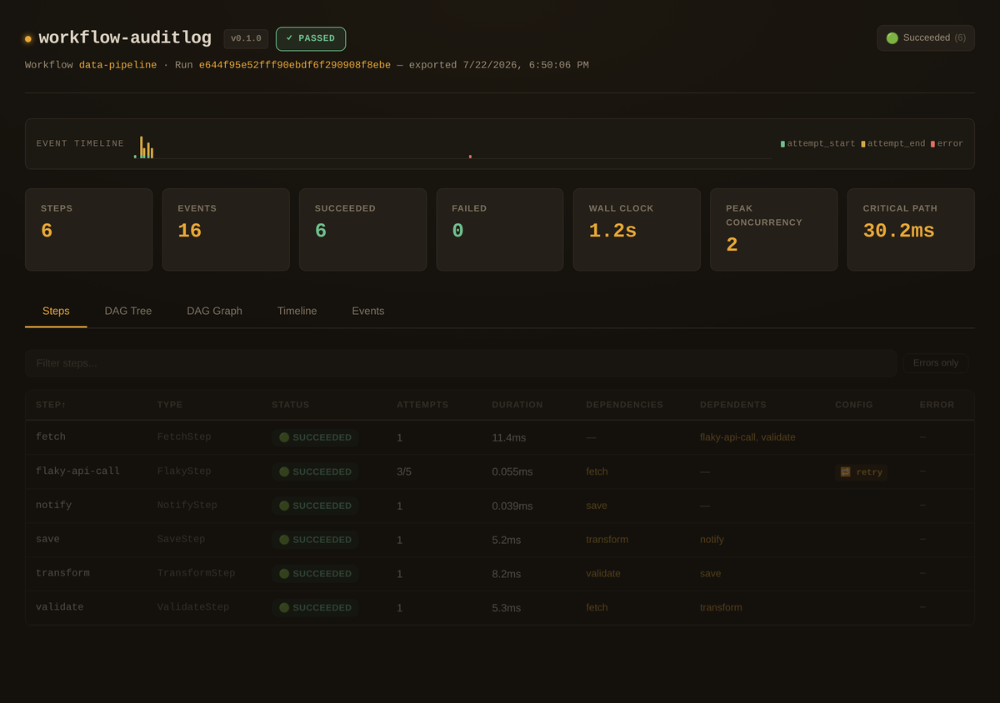
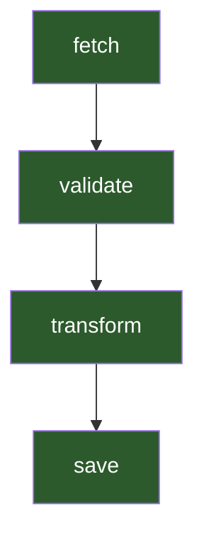
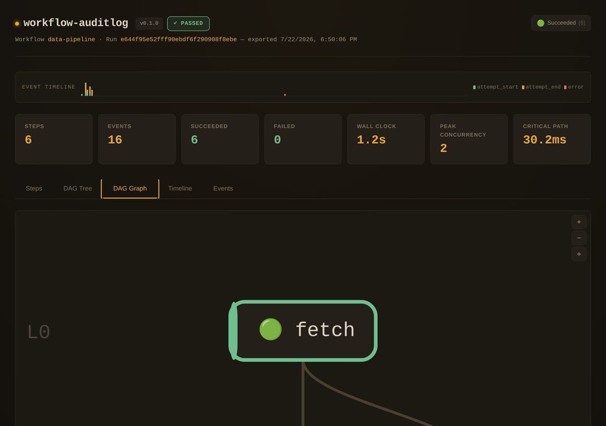
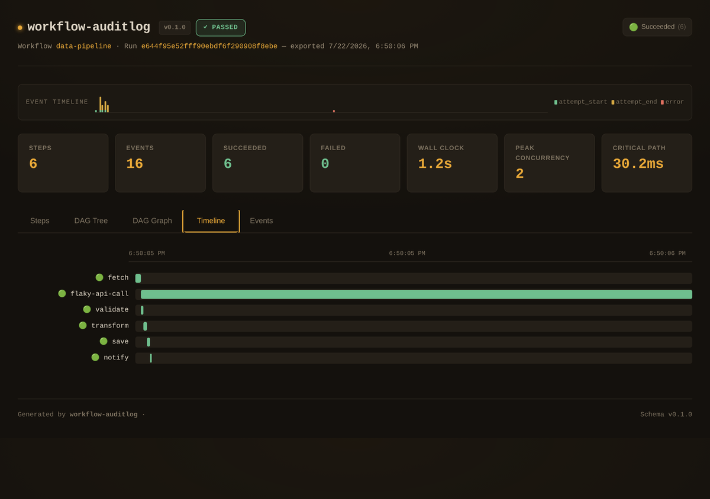
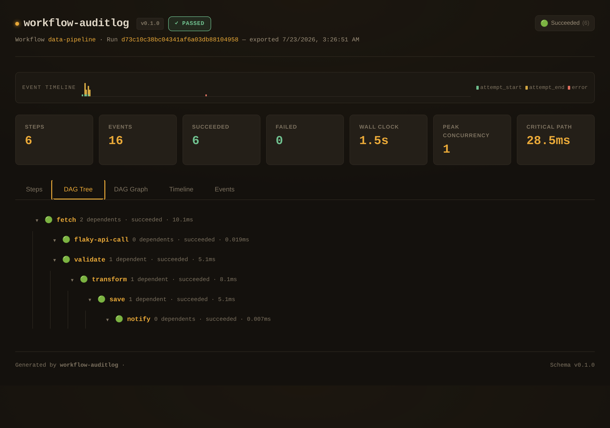

# go-workflow-auditlog

[](https://pkg.go.dev/github.com/larsartmann/go-workflow-auditlog)
[](https://github.com/LarsArtmann/go-workflow-auditlog/actions/workflows/ci.yml)
[](#)
[](LICENSE)
[](https://go.dev)

**[Documentation](https://go-workflow-auditlog.lars.software)** · **[API Reference](https://pkg.go.dev/github.com/larsartmann/go-workflow-auditlog)** · **[Viz API Reference](https://pkg.go.dev/github.com/larsartmann/go-workflow-auditlog/viz)** · **[Interactive Demo](./viz/example)**

---

Audit logging library for [Azure/go-workflow](https://github.com/Azure/go-workflow) — records every step execution event (attempts, retries, durations, errors, dependencies, final statuses) with timestamped events and export to JSON / NDJSON. The optional `viz` sub-module adds diagrams / tables / trees / an interactive HTML dashboard.

```go
audit.Attach(w)                      // 1. Inject callbacks
_ = w.Do(context.Background())       // 2. Run workflow
audit.Snapshot(w)                    // 3. Capture final state

// Core JSON/NDJSON export (no extra dependencies)
_ = audit.ExportJSON("report.json")
_ = audit.ExportNDJSON("events.ndjson")

// Visualization requires the github.com/larsartmann/go-workflow-auditlog/viz module
import viz "github.com/larsartmann/go-workflow-auditlog/viz"
_ = viz.ExportHTML(audit.Report(), "report.html")
```

The `viz.ExportHTML` call produces a self-contained interactive dashboard:



---

## Why?

[Azure/go-workflow](https://github.com/Azure/go-workflow) is a powerful DAG-based workflow engine, but it provides **zero visibility** into what happened during execution:

- **No per-attempt events** — you see the final error, not which retry failed or how long each attempt took
- **No DAG structure** — the dependency graph exists at runtime but is never recorded
- **No skipped/canceled detection** — steps settled by Conditions bypass all callbacks
- **No exportable reports** — the workflow state vanishes when the process exits

**go-workflow-auditlog fixes all of this** with three lines of code. Every retry, every duration, every error — captured automatically as timestamped events and exportable to 12+ formats including an interactive HTML dashboard.

---

## Table of Contents

- [Features](#features)
- [Installation](#installation)
- [Quick Start](#quick-start)
- [Example Output](#example-output)
- [How It Works](#how-it-works)
- [Report Structure](#report-structure)
- [API Reference](#api-reference)
- [Config](#config)
- [Diagrams](#diagrams)
- [HTML Dashboard](#html-dashboard)
- [Concurrency Model](#concurrency-model)
- [Step Naming](#step-naming)
- [Known Limitations](#known-limitations)
- [Contributing](#contributing)
- [License](#license)

---

## Features

- **Per-attempt event capture** — records every `attempt_start` / `attempt_end` with timestamp, duration, error, and status
- **Full DAG structure** — captures dependency graph (upstream + dependents), retry/timeout config, and step types
- **Skipped & canceled detection** — reads post-execution state to catch steps that bypass callbacks entirely
- **Cross-system correlation** — 128-bit `RunID` stamped on every event for trace/log correlation
- **Export formats** — JSON report, NDJSON event stream, Mermaid / PlantUML / Graphviz DOT / D2 diagrams (with configurable layout direction), step summary tables (16 formats, configurable column selection), ASCII + HTML tree views, **interactive HTML dashboard** (5-tab self-contained report with DAG graph engine, timeline, waveform)
- **Report filtering** — slice reports by step name, status, event type, or time range
- **Report diffing** — compare two runs for regression detection (added/removed/changed steps + duration delta)
- **Event replay** — reconstruct a report from a flat NDJSON event stream
- **O(1) lookups** — `ReportIndex` precomputes lookup maps for repeated queries
- **Sentinel errors** — matchable via `errors.Is` for programmatic branching
- **Error classification** — auto-registered with [go-error-family](https://github.com/larsartmann/go-error-family) for `Classify()`, `IsRetryable()`, `ExitCode()`
- **319 tests, ~96% coverage** with race detector, 0 lint issues, 0 runtime dependencies beyond go-workflow + backoff/v4

## Installation

```bash
# Core module (event recording, JSON/NDJSON, report, replay, diff, filter, index)
go get github.com/larsartmann/go-workflow-auditlog

# Visualization module (diagrams, tables, trees, HTML dashboard)
go get github.com/larsartmann/go-workflow-auditlog/viz
```

Requires Go 1.26+ and `github.com/Azure/go-workflow v0.1.13`. The `viz` module also requires `github.com/larsartmann/go-output` and its format-specific sub-modules.

## Quick Start

```go
package main

import (
    "context"
    "fmt"

    flow "github.com/Azure/go-workflow"

    "github.com/larsartmann/go-workflow-auditlog"
)

type FetchStep struct{ Data []byte }
func (s *FetchStep) Do(_ context.Context) error { s.Data = []byte("hello"); return nil }
func (s *FetchStep) String() string             { return "fetch" }

type SaveStep struct{ Input []byte }
func (s *SaveStep) Do(_ context.Context) error  { return nil }
func (s *SaveStep) String() string              { return "save" }

func main() {
    audit, _ := auditlog.New(auditlog.Config{
        Enabled:    true,
        WorkflowID: "my-pipeline",
    })

    fetch := &FetchStep{}
    save := &SaveStep{}

    w := &flow.Workflow{}
    w.Add(
        flow.Step(fetch),
        flow.Step(save).DependsOn(fetch),
    )

    // 1. Attach audit callbacks BEFORE running
    audit.Attach(w)

    // 2. Run the workflow
    _ = w.Do(context.Background())

    // 3. Snapshot final state AFTER running
    audit.Snapshot(w)

    // 4. Read the report
    report := audit.Report()
    fmt.Printf("Steps: %d, Events: %d\n", report.StepCount, report.EventCount)
    fmt.Println(report.Summary())

    // Export
    _ = audit.ExportJSON("audit.json")
    _ = audit.ExportNDJSON("events.ndjson")
}
```

The three-step lifecycle is **always** `Attach` → `Do` → `Snapshot`:

| Step       | When        | What it captures                                |
| ---------- | ----------- | ----------------------------------------------- |
| `Attach`   | Before `Do` | Injects audit callbacks into every step         |
| `Do`       | Execution   | Callbacks fire per-attempt, recording events    |
| `Snapshot` | After `Do`  | Reads DAG structure + skipped/canceled statuses |

## Example Output

Run the bundled demo:

```bash
go run ./viz/example
```

```
━━━ demo version: dev | run id: 1dc74b1ad3d1b5c84e76097018e643f9 ━━━
  [audit] ▶ #1 attempt_start attempt=1 step=fetch
  [audit] ■ #2 attempt_end attempt=1 step=fetch (10.12ms)
  [audit] ▶ #3 attempt_start attempt=1 step=flaky-api-call
  [audit] ■ #4 attempt_end attempt=1 step=flaky-api-call error=transient error (0.01ms)
  [audit] ▶ #13 attempt_start attempt=2 step=flaky-api-call
  [audit] ■ #14 attempt_end attempt=2 step=flaky-api-call error=transient error (0.02ms)
  [audit] ▶ #15 attempt_start attempt=3 step=flaky-api-call
  → flaky step succeeded on attempt 3
  [audit] ■ #16 attempt_end attempt=3 step=flaky-api-call (0.02ms)
━━━ Workflow completed in 911.58ms ━━━

━━━ Audit Report ━━━
Workflow:     data-pipeline
Steps:        6
Succeeded:    6
Failed:       0
Events:       16
Total time:   28.53ms
Succeeded:    true

━━━ Step Details ━━━
  🟢 fetch [succeeded] attempts=1 type=FetchStep (10.12ms)
  🟢 flaky-api-call [succeeded] attempts=3 deps=[fetch] retry(max=5) error=transient error
  🟢 save [succeeded] attempts=1 type=SaveStep (5.12ms) deps=[transform]
```

## How It Works

go-workflow v0.1.13 provides `BeforeStep` and `AfterStep` callbacks per step, fired per attempt (each retry try). This library:

1. **`Attach(w)`** — injects audit `BeforeStep`/`AfterStep` callbacks into every step in the workflow via `State.MergeConfig`. Must be called **before** `w.Do(ctx)`.

2. **Execution** — during `w.Do(ctx)`, each step's callbacks fire on every attempt, recording timestamped `attempt_start` and `attempt_end` events with duration, error, and status.

3. **`Snapshot(w)`** — reads the workflow's post-execution state to capture the full DAG structure, final statuses, retry/timeout config, and any steps that were **skipped or canceled** (which bypass callbacks entirely). Must be called **after** `w.Do(ctx)`.

### Why Snapshot is needed

Steps settled inline by Conditions (Skipped/Canceled) never enter the interceptor/callback chain. `Snapshot(w)` reads `w.StateOf(step)` and `w.UpstreamOf(step)` to fill these gaps. Without it, the report is missing the dependency graph and non-executed step statuses.

### Why BeforeStep must pass through context

The `BeforeStep` callback signature is `func(ctx, Steper) (context.Context, error)`. The returned context flows into `step.Do(ctx)`. If the callback returns `context.Background()`, **step-level timeouts are destroyed**. This library returns the original `ctx` unchanged.

## Report Structure

```json
{
  "version": "0.1.0",
  "workflow_id": "my-pipeline",
  "run_id": "a1b2c3d4e5f6a7b8c9d0e1f2a3b4c5d6",
  "exported_at": "2026-06-18T15:21:09Z",
  "event_count": 4,
  "step_count": 2,
  "succeeded_count": 2,
  "failed_count": 0,
  "skipped_count": 0,
  "canceled_count": 0,
  "pending_count": 0,
  "running_count": 0,
  "total_duration_ms": 15.23,
  "wall_clock_duration_ms": 15.23,
  "workflow_succeeded": true,
  "dropped_event_count": 0,
  "peak_concurrency": 1,
  "critical_path_duration_ms": 15.23,
  "steps": [
    {
      "step_name": "fetch",
      "step_type": "FetchStep",
      "step_id": 1,
      "status": "succeeded",
      "attempt_count": 1,
      "duration_ms": 10.5,
      "has_retry": false,
      "has_timeout": false,
      "dependents": [{ "step_name": "save" }]
    }
  ],
  "events": [
    {
      "run_id": "a1b2c3d4e5f6a7b8c9d0e1f2a3b4c5d6",
      "sequence": 1,
      "timestamp": "2026-06-18T15:21:09Z",
      "event_type": "attempt_start",
      "phase": "before",
      "step_name": "fetch",
      "attempt": 1
    }
  ]
}
```

### Three Duration Metrics

The report carries three duration fields that answer different questions.
**Always use `wall_clock_duration_ms` for user-facing summaries and
regression detection.**

| Field                       | What it measures                                 | When it differs                                                                                                                                          |
| --------------------------- | ------------------------------------------------ | -------------------------------------------------------------------------------------------------------------------------------------------------------- |
| `total_duration_ms`         | Sum of every step's individual duration          | Inflated for parallel workflows — counts overlapping time multiple times. A 36-step pipeline running in 64&nbsp;s wall-clock can report 265&nbsp;s here. |
| `wall_clock_duration_ms`    | Actual elapsed time (earliest → latest event)    | The "how long did I wait?" number. Matches what a stopwatch would show. **Use this for summaries, `Summary()`, and `Diff()`.**                           |
| `critical_path_duration_ms` | Longest dependency-chain duration (memoized DFS) | The bottleneck path. If you can only parallelize one thing, this tells you which.                                                                        |

## API Reference

### `auditlog.New(config Config) (*Auditor, error)`

Creates an auditor. When `Config.Enabled` is false, checks the `WORKFLOW_AUDITLOG_ENABLED` env var (`"true"`, `"1"`, `"yes"`).

### `Auditor` Methods

| Method                                                | Description                                                  |
| ----------------------------------------------------- | ------------------------------------------------------------ |
| `Attach(w *flow.Workflow) *flow.Workflow`             | Injects audit callbacks into all steps. Call before `Do`.    |
| `Snapshot(w *flow.Workflow)`                          | Captures final DAG state. Call after `Do`.                   |
| `Report() WorkflowReport`                             | Returns the consolidated report.                             |
| `Events() []Event`                                    | Returns all captured events.                                 |
| `EventsCount() int`                                   | Event count without copying.                                 |
| `DroppedEventCount() int64`                           | Events dropped due to `MaxEvents` cap.                       |
| `RunID() string`                                      | The run identifier stamped on every event (for correlation). |
| `ReportFiltered(opts ...ReportOption) WorkflowReport` | Returns a filtered report (by name/status/event-type/time).  |
| `ExportJSON(path string) error`                       | Writes report as JSON.                                       |
| `ExportNDJSON(path string) error`                     | Writes events as NDJSON.                                     |
| `WriteJSON(w io.Writer) error`                        | Writes report JSON to writer.                                |
| `WriteNDJSON(w io.Writer) error`                      | Writes NDJSON to writer.                                     |

Visualization functions live in `github.com/larsartmann/go-workflow-auditlog/viz` and operate on a `WorkflowReport` (e.g. from `audit.Report()`):

```go
import viz "github.com/larsartmann/go-workflow-auditlog/viz"

report := audit.Report()
_ = viz.ExportMermaid(report, "dag.mmd")
_ = viz.ExportHTML(report, "dashboard.html")
```

### `WorkflowReport` Methods

| Method                                                 | Description                                                          |
| ------------------------------------------------------ | -------------------------------------------------------------------- |
| `report.StepByName(name)`                              | Find a step by name.                                                 |
| `report.EventsByStep(name)`                            | Filter events by step.                                               |
| `report.EventsByType(type)`                            | Filter events by type.                                               |
| `report.FailedSteps()`                                 | All failed/canceled steps.                                           |
| `report.SucceededSteps()`                              | All succeeded steps.                                                 |
| `report.SkippedSteps()`                                | All skipped steps.                                                   |
| `report.RetriedSteps()`                                | All steps with >1 attempt.                                           |
| `report.Filtered(opts ...ReportOption) WorkflowReport` | Returns a filtered copy of the report.                               |
| `report.Diff(other WorkflowReport) DiffResult`         | Compares two reports (added/removed/changed steps + duration delta). |
| `report.Duration() time.Duration`                      | Wall-clock duration spanned by all events (earliest → latest).       |
| `report.Summary() string`                              | One-line human-readable summary.                                     |
| `report.WriteJSON(w io.Writer) error`                  | Serialize report as JSON.                                            |
| `report.WriteNDJSON(w io.Writer) error`                | Serialize events as NDJSON.                                          |
| `report.ExportJSON(path string) error`                 | Writes JSON report to file.                                          |
| `report.ExportNDJSON(path string) error`               | Writes NDJSON events to file.                                        |
| `report.Validate() error`                              | Checks internal consistency (counts, status drift).                  |

### `viz` Package Functions

All visualization functions take the report as the first argument:

| Function                                                                          | Description                                                  |
| --------------------------------------------------------------------------------- | ------------------------------------------------------------ |
| `viz.WriteMermaid(r, w io.Writer, opts ...DiagramOption) error`                   | Mermaid diagram (supports `viz.WithDirection`).              |
| `viz.WritePlantUML(r, w io.Writer, opts ...DiagramOption) error`                  | PlantUML diagram (supports `viz.WithDirection`).             |
| `viz.WriteGraphviz(r, w io.Writer, opts ...DiagramOption) error`                  | Graphviz DOT diagram (supports `viz.WithDirection`).         |
| `viz.WriteD2(r, w io.Writer, opts ...DiagramOption) error`                        | D2 diagram (supports `viz.WithDirection`).                   |
| `viz.WriteMermaidString(r, opts ...DiagramOption) (string, error)`                | Mermaid diagram as string.                                   |
| `viz.WritePlantUMLString(r, opts ...DiagramOption) (string, error)`               | PlantUML diagram as string.                                  |
| `viz.WriteGraphvizString(r, opts ...DiagramOption) (string, error)`               | Graphviz DOT diagram as string.                              |
| `viz.WriteD2String(r, opts ...DiagramOption) (string, error)`                     | D2 diagram as string.                                        |
| `viz.WriteTable(r, w, format, opts, tableOpts ...TableOption) error`              | Step summary table (16 formats, supports `viz.WithColumns`). |
| `viz.WriteTableString(r, format, opts, tableOpts ...TableOption) (string, error)` | Step summary table as string (supports `viz.WithColumns`).   |
| `viz.WriteTree(r, w io.Writer) error`                                             | ASCII tree of step DAG.                                      |
| `viz.WriteTreeString(r) (string, error)`                                          | ASCII tree as string.                                        |
| `viz.WriteHTMLTree(r, w io.Writer) error`                                         | HTML nested-list tree of step DAG.                           |
| `viz.WriteHTMLTreeString(r) (string, error)`                                      | HTML tree as string.                                         |
| `viz.WriteHTML(r, w io.Writer) error`                                             | Interactive HTML dashboard (5-tab report with DAG graph).    |
| `viz.WriteHTMLString(r) (string, error)`                                          | HTML dashboard as string.                                    |
| `viz.ExportMermaid(r, path string) error`                                         | Writes Mermaid DAG to file.                                  |
| `viz.ExportPlantUML(r, path string) error`                                        | Writes PlantUML DAG to file.                                 |
| `viz.ExportGraphviz(r, path string) error`                                        | Writes Graphviz DOT DAG to file.                             |
| `viz.ExportD2(r, path string) error`                                              | Writes D2 DAG to file.                                       |
| `viz.ExportTable(r, path string, format, opts, tableOpts ...TableOption) error`   | Writes step summary table to file.                           |
| `viz.ExportTree(r, path string) error`                                            | Writes ASCII tree to file.                                   |
| `viz.ExportHTMLTree(r, path string) error`                                        | Writes HTML tree to file.                                    |
| `viz.ExportHTML(r, path string) error`                                            | Writes interactive HTML dashboard to file.                   |

### Package-Level Functions

| Function                                                             | Description                                    |
| -------------------------------------------------------------------- | ---------------------------------------------- |
| `auditlog.LoadReport(path string) (WorkflowReport, error)`           | Load a JSON report from a file.                |
| `auditlog.LoadReportFromReader(r io.Reader) (WorkflowReport, error)` | Load a JSON report from a reader.              |
| `auditlog.LoadReportFromBytes(b []byte) (WorkflowReport, error)`     | Load a JSON report from bytes.                 |
| `auditlog.ReadEvents(r io.Reader) ([]Event, error)`                  | Read NDJSON events (inverse of `WriteNDJSON`). |
| `auditlog.ReplayEvents(events []Event) (WorkflowReport, error)`      | Reconstruct a report from a flat event stream. |
| `auditlog.NewReportIndex(r WorkflowReport) *ReportIndex`             | Precompute O(1) lookup maps over a report.     |

### Sentinel Errors

These exported errors are returned by `Validate()`, `New()`, `LoadReport()`, and export methods. Match them with `errors.Is`:

| Error                            | Returned when                                                        |
| -------------------------------- | -------------------------------------------------------------------- |
| `auditlog.ErrWorkflowIDPathSep`  | `Config.WorkflowID` contains `/` or `\`.                             |
| `auditlog.ErrEventCountMismatch` | Report `EventCount` ≠ `len(Events)`.                                 |
| `auditlog.ErrStepCountMismatch`  | Report `StepCount` ≠ `len(Steps)`.                                   |
| `auditlog.ErrStatusDrift`        | A step's `Status` disagrees with its derived status.                 |
| `auditlog.ErrCountMismatch`      | A denormalized status-count field disagrees with actual step counts. |
| `auditlog.ErrReplayNoEvents`     | `ReplayEvents` received zero events.                                 |
| `auditlog.ErrEmpty`              | `ReadEvents` input is empty.                                         |
| `auditlog.ErrNoEvents`           | `ReadEvents` input contains no events (all blank lines).             |
| `auditlog.ErrOversizedLine`      | `ReadEvents` line exceeds 1 MB.                                      |
| `auditlog.ErrReportLoadFailed`   | `LoadReport`/`LoadReportFromReader`/`LoadReportFromBytes` failed.    |
| `auditlog.ErrRenderFailed`       | Diagram/table/HTML/JSON rendering or marshaling failed.              |
| `auditlog.ErrExportWriteFailed`  | File write or I/O flush failed during export.                        |

### Error Classification

All sentinel errors are automatically registered with [go-error-family](https://github.com/larsartmann/go-error-family) on import. Consumers can call `errorfamily.Classify(err)`, `errorfamily.IsRetryable(err)`, or `errorfamily.ExitCode(err)` on any auditlog error without additional setup:

```go
import (
    "github.com/larsartmann/go-error-family"
    "github.com/larsartmann/go-workflow-auditlog"
)

err := auditlog.LoadReport("report.json")

if errorfamily.IsRetryable(err) {
    // Transient failure — back off and retry
}

switch errorfamily.Classify(err) {
case errorfamily.Corruption:
    // Data integrity violation (ErrEventCountMismatch, ErrStatusDrift, etc.)
case errorfamily.Rejection:
    // Bad caller input (ErrEmpty, ErrNoEvents, ErrOversizedLine, etc.)
case errorfamily.Transient:
    // Retryable failure (ErrReportLoadFailed)
case errorfamily.Infrastructure:
    // System-level failure (ErrRenderFailed, ErrExportWriteFailed)
}
```

| Family         | Retry? | Exit | Sentinel errors                                                                            |
| -------------- | ------ | ---- | ------------------------------------------------------------------------------------------ |
| Corruption     | No     | 65   | `ErrEventCountMismatch`, `ErrStepCountMismatch`, `ErrStatusDrift`, `ErrCountMismatch`      |
| Rejection      | No     | 1    | `ErrEmpty`, `ErrNoEvents`, `ErrOversizedLine`, `ErrWorkflowIDPathSep`, `ErrReplayNoEvents` |
| Transient      | Yes    | 75   | `ErrReportLoadFailed`                                                                      |
| Infrastructure | No     | 69   | `ErrRenderFailed`, `ErrExportWriteFailed`                                                  |

For custom registries, call `auditlog.RegisterClassifications(reg)` explicitly.

## Config

| Field                  | Default                      | Description                                                                                                    |
| ---------------------- | ---------------------------- | -------------------------------------------------------------------------------------------------------------- |
| `Enabled`              | `false` (checks env var)     | Turns audit logging on/off.                                                                                    |
| `WorkflowID`           | `"default"`                  | Human-readable identifier.                                                                                     |
| `RunID`                | auto-generated (128-bit hex) | Identifier for one execution; stamped on every event for trace correlation. Override to use your own trace ID. |
| `OnEvent`              | `nil`                        | Callback fired after each event. Fires concurrently — must be goroutine-safe.                                  |
| `MaxEvents`            | `0` (unlimited)              | Caps stored events to prevent OOM. Excess counted in `DroppedEventCount`.                                      |
| `InitialEventCapacity` | `256`                        | Pre-allocates event slice.                                                                                     |

## Diagrams

Export the step DAG in four formats, with status-based coloring (succeeded = green, failed = red, skipped = gray, canceled = orange). All diagram writers accept `viz.WithDirection` to control layout:

```go
import (
    "github.com/larsartmann/go-output"
    viz "github.com/larsartmann/go-workflow-auditlog/viz"
)

_ = viz.WriteMermaid(report, os.Stdout,
    viz.WithDirection(output.DirectionRight))  // left-to-right layout

_ = viz.WriteGraphviz(report, os.Stdout,
    viz.WithDirection(output.DirectionUp))     // bottom-to-top
```

Supported directions: `DirectionDown` (default), `DirectionRight`, `DirectionUp`, `DirectionLeft`. Available on all four formats (Mermaid, PlantUML, Graphviz DOT, D2).

**Mermaid** (renders natively in GitHub):



**Graphviz DOT**:

```dot
digraph workflow {
  rankdir=TB;
  node [shape=box fontname="Helvetica"];

  "fetch" [label="fetch" fillcolor=#2d5a2d];
  "validate" [label="validate" fillcolor=#2d5a2d];
  "transform" [label="transform" fillcolor=#2d5a2d];
  "save" [label="save" fillcolor=#2d5a2d];

  "fetch" -> "validate";
  "validate" -> "transform";
  "transform" -> "save";
}
```

Generate diagrams from any report:

```go
_ = viz.WriteMermaid(report, os.Stdout)      // or viz.ExportMermaid(report, "dag.mmd")
_ = viz.WriteGraphviz(report, os.Stdout)     // or viz.ExportGraphviz(report, "dag.dot")
_ = viz.WritePlantUML(report, os.Stdout)     // or viz.ExportPlantUML(report, "dag.puml")
_ = viz.WriteD2(report, os.Stdout)           // or viz.ExportD2(report, "dag.d2")
_ = viz.WriteTable(report, os.Stdout, output.FormatCSV, output.RenderOptions{},
    viz.WithColumns(viz.ColumnStep, viz.ColumnStatus, viz.ColumnDuration))
_ = viz.WriteTree(report, os.Stdout)         // ASCII tree of step DAG
_ = viz.WriteHTMLTree(report, os.Stdout)     // HTML nested-list tree
_ = viz.ExportHTML(report, "dashboard.html")  // interactive HTML dashboard
```

### Configurable Table Columns

The `viz.WriteTable` / `viz.WriteTableString` / `viz.ExportTable` functions accept `viz.WithColumns` to control which columns appear. Ten columns are available:

| Column       | Constant                 | Default? |
| ------------ | ------------------------ | -------- |
| Step name    | `viz.ColumnStep`         | Yes      |
| Status       | `viz.ColumnStatus`       | Yes      |
| Duration     | `viz.ColumnDuration`     | Yes      |
| Attempts     | `viz.ColumnAttempts`     | Yes      |
| Max Attempts | `viz.ColumnMaxAttempts`  |          |
| Has Retry    | `viz.ColumnRetry`        | Yes      |
| Has Timeout  | `viz.ColumnTimeout`      | Yes      |
| Error        | `viz.ColumnError`        | Yes      |
| Type         | `viz.ColumnType`         |          |
| Dependencies | `viz.ColumnDependencies` |          |

```go
// Compact table: just step name, status, and duration
out, _ := viz.WriteTableString(report, output.FormatMarkdown, output.RenderOptions{},
    viz.WithColumns(viz.ColumnStep, viz.ColumnStatus, viz.ColumnDuration))

// Full table: all 10 columns
out, _ := viz.WriteTableString(report, output.FormatCSV, output.RenderOptions{},
    viz.WithColumns(viz.AllTableColumns()...)
```

## HTML Dashboard

The `viz.WriteHTML` / `viz.ExportHTML` functions produce a **self-contained interactive HTML dashboard** — a single file with embedded CSS and JavaScript, no external dependencies. Open it in any browser or attach it to a report/email.

**Five tabs:**

1. **Steps** — sortable, filterable table with pagination (step name, type, status, attempts, duration, dependencies, dependents, retry/timeout config)
2. **DAG Tree** — collapsible tree of the step dependency graph (root = no dependencies, children = dependents)
3. **DAG Graph** — interactive SVG with Sugiyama layered layout (pan/zoom/touch/click-to-highlight), built from the same DAG as the other exports
4. **Timeline** — horizontal bar chart of step durations, sorted by duration, color-coded by status
5. **Events** — sortable event stream with type filters and pagination

**Security:** Report data is injected via `<script type="application/json">` tags (never parsed as HTML). Dynamic content is escaped via a JS `esc()` function. Strict CSP: `default-src 'none'`. XSS-tested via fuzz target `FuzzHTMLSpecialChars`.

<table>
  <tr>
    <td width="50%" align="center"><b>DAG Graph</b> — interactive SVG with pan/zoom</td>
    <td width="50%" align="center"><b>Timeline</b> — duration bar chart by status</td>
  </tr>
  <tr>
    <td></td>
    <td></td>
  </tr>
  <tr>
    <td align="center"><b>Steps Table</b> — sortable, filterable</td>
    <td align="center"><b>DAG Tree</b> — collapsible dependency tree</td>
  </tr>
  <tr>
    <td></td>
    <td></td>
  </tr>
</table>

```go
// From an Auditor (live workflow):
viz.ExportHTML(audit.Report(), "dashboard.html")

// From a WorkflowReport (e.g. loaded from JSON):
report, _ := auditlog.LoadReport("report.json")
viz.ExportHTML(report, "dashboard.html")

// To a string:
html, _ := viz.WriteHTMLString(report)
```

## Concurrency Model

- Single `sync.RWMutex` protects all mutable state (`events`, `steps`, `stepCounter`).
- `BeforeStep`/`AfterStep` callbacks acquire the write lock once per call.
- `OnEvent` callback fires **outside** the lock — but **concurrently** from parallel step goroutines. It must be goroutine-safe.
- `BuildReport()` uses `RLock` — concurrent reads don't block each other.

## Step Naming

go-workflow uses `flow.String(step)` for display names. By default this returns `*TypeName(0xpointer)` which is non-deterministic across runs. For clean audit output, implement `String()` on your step types:

```go
func (s *MyStep) String() string { return "my-meaningful-name" }
```

Or use `flow.Name(step, "name")` when adding to the workflow.

## Known Limitations

- **Step name collisions**: step identity is tracked internally by the `flow.Steper` pointer (always unique), but the JSON `step_name` field relies on `flow.String(step)`. If two steps produce the same `String()` output, their JSON output is ambiguous. Use the `step_id` field (1-based, stable per run) to disambiguate, or give each step a distinct `String()`.
- **Snapshot is mandatory for full DAG**: `Attach` captures per-attempt events; the dependency graph and skipped/canceled statuses are only filled in after `Snapshot(w)` reads the workflow's final state.
- **Replay loses DAG edges**: `ReplayEvents` reconstructs a report from a flat event stream. Dependencies, `MaxAttempts`, `HasRetry`, and `HasTimeout` are not available from events alone — use a Snapshot-captured report for full fidelity.
- **go-workflow retry data race**: `DefaultRetryOption.Backoff` shares a single `ExponentialBackOff` instance that races under concurrent use. This is a known upstream issue in v0.1.13.
- **`WorkflowID` cannot contain path separators** (`/` or `\`): it is used in export filenames and would break path safety. Use `Config.RunID` or your own export paths for arbitrary identifiers.

## Contributing

Contributions are welcome! See [CONTRIBUTING.md](CONTRIBUTING.md) for development setup, testing patterns, code style, and the release process.

- [Changelog](CHANGELOG.md)
- [Code of Conduct](CODE_OF_CONDUCT.md)
- [Report a bug or request a feature](https://github.com/LarsArtmann/go-workflow-auditlog/issues)

## License

[MIT](LICENSE) — Copyright (c) 2026 Lars Artmann
