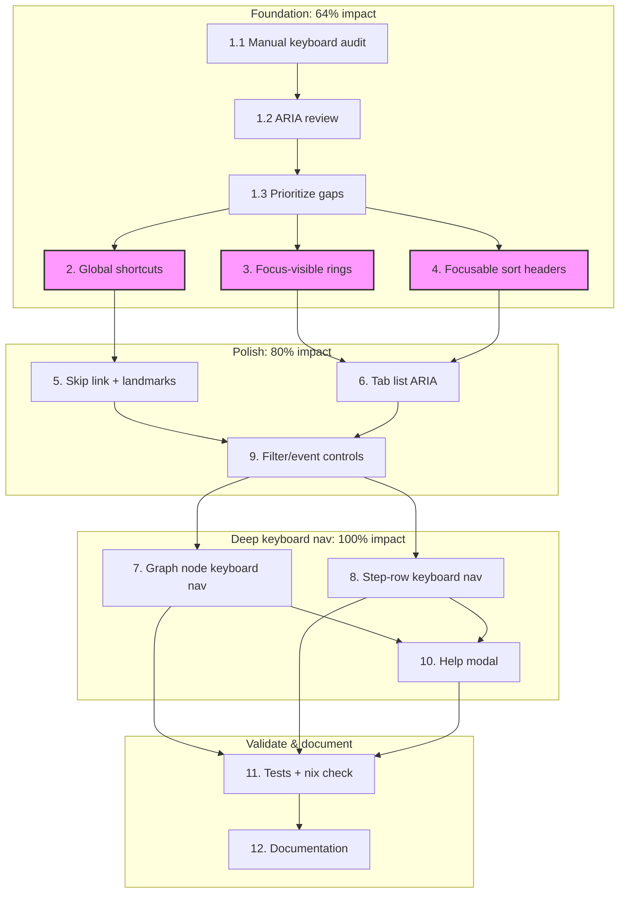

# Keyboard Navigation Improvement Plan

**Date:** 2026-07-30  
**Scope:** `live/dashboard.js`, `live/dashboard.css`, `live/dashboard.go` template, and structural tests.  
**Goal:** Make the live workflow dashboard fully operable from the keyboard without regressing mouse/touch behavior or SSE/WebSocket streaming.

---

## Pareto Analysis

| Slice             | Share of work  | Share of impact | What it is                                                                                              |
| ----------------- | -------------- | --------------- | ------------------------------------------------------------------------------------------------------- |
| **1%**            | ~1 of 12 tasks | **51%**         | Global keyboard shortcuts (tab switching, focus search, toggle filters)                                 |
| **4%**            | ~2 of 12 tasks | **64%**         | Global shortcuts + focusable sortable headers + visible `:focus-visible` rings                          |
| **20%**           | ~4 of 12 tasks | **80%**         | All above + skip link + tab-list ARIA improvements + keyboard-driven filter/event controls              |
| **Remaining 80%** | All 12 tasks   | **100%**        | Graph node keyboard navigation, step-row keyboard navigation, shortcut help modal, tests, documentation |

**Why this ordering:** Power users and assistive-technology users hit the same bottlenecks first. Global shortcuts remove the need to tab through every control; focusable headers and visible focus rings fix the most common “I can’t tell where I am” problem. Graph and row navigation are high-value but require more DOM coupling, so they follow the foundational work.

---

## Current State Snapshot

What already works:

- Tab bar follows the ARIA Tabs pattern: arrow keys move between tabs, only the active tab is in the natural tab order, and `aria-selected` updates.
- `Escape` closes the floating error tooltip.
- Buttons, links, and inputs are natively focusable.

What is broken or missing:

- Sortable table headers (`<th data-sort>`) are not focusable and have no keyboard activation.
- No visible `:focus-visible` rings for tabs, chips, graph nodes, or export links.
- No global shortcuts; users must tab repeatedly to reach common controls.
- No “Skip to main content” link.
- Graph nodes are mouse-only.
- Step table rows are not keyboard navigable.
- No keyboard shortcut reference/help.
- `aria-live` regions are not used for the live badge or streaming status updates.

---

## Comprehensive Plan (Tasks 30–100 min)

| #   | Task                                                  | Duration | Impact    | Effort | Customer Value | Notes                                                                                                                                                                                                                                 |
| --- | ----------------------------------------------------- | -------- | --------- | ------ | -------------- | ------------------------------------------------------------------------------------------------------------------------------------------------------------------------------------------------------------------------------------- |
| 1   | **Audit keyboard accessibility**                      | 60 min   | High      | Low    | Critical       | Manual keyboard-only walkthrough, screen-reader/ARIA review, gap list with priorities.                                                                                                                                                |
| 2   | **Implement global keyboard shortcuts**               | 90 min   | Very High | Medium | Very High      | 1–4 for tabs, `/` for step search, `g` for graph search, `e` for errors-only, `c` for critical path, `f` for fit, `+/-` for zoom, `x` for expand, `Esc` for tooltip, `?` for help. Guarded when focus is in an input/textarea/select. |
| 3   | **Add visible `:focus-visible` rings**                | 60 min   | High      | Low    | High           | Tabs, chips, buttons, export links, graph nodes, table headers, table rows. Maintain existing hover styling.                                                                                                                          |
| 4   | **Make sortable table headers keyboard-accessible**   | 45 min   | High      | Low    | High           | Add `tabindex="0"`, `Enter`/`Space` activation, `aria-sort` on the active header, and sort-direction indicators.                                                                                                                      |
| 5   | **Add skip link and landmark structure**              | 30 min   | Medium    | Low    | Medium         | Skip-to-main link at body top, `<main>` landmark, proper header/nav roles.                                                                                                                                                            |
| 6   | **Enhance tab-list ARIA keyboard behavior**           | 45 min   | Medium    | Low    | Medium         | `Home`/`End` keys, manual-activation fallback, move focus to `tabpanel` after activation.                                                                                                                                             |
| 7   | **Implement keyboard controls for graph nodes**       | 90 min   | High      | High   | High           | Make nodes focusable, arrow-key traversal along edges, `Enter`/`Space` to select and jump to the step row, `aria-label` with status + duration.                                                                                       |
| 8   | **Implement keyboard navigation for step table rows** | 75 min   | High      | Medium | High           | Roving `tabindex` on rows, `Up`/`Down` navigation, `Home`/`End`, `Enter`/`Space` to open the error tooltip.                                                                                                                           |
| 9   | **Improve filter and event controls keyboard UX**     | 45 min   | Medium    | Low    | Medium         | Focus-visible for chips, keyboard shortcuts for event filter buttons (`1` all, `2` attempt_start, `3` attempt_end), `e` for errors-only toggle.                                                                                       |
| 10  | **Add keyboard shortcut help modal**                  | 60 min   | Medium    | Medium | Medium         | Accessible modal dialog listing all shortcuts, `?` to open, `Esc` to close, focus trap, first-focus on the close button.                                                                                                              |
| 11  | **Update tests and validate structural integrity**    | 75 min   | Very High | Medium | Very High      | Add structural tests for new JS functions, add keyboard-navigation assertions, run `GOEXPERIMENT=jsonv2 go test ./...` for live, run `nix run .#check` for full suite.                                                                |
| 12  | **Update documentation and AGENTS.md**                | 45 min   | Medium    | Low    | Medium         | Document keyboard shortcuts and accessibility features in `AGENTS.md`, add a note to `CHANGELOG.md`.                                                                                                                                  |

**Total comprehensive plan duration:** ~12 hours (720 min).  
**Recommended first milestone:** Tasks 1–4 (4.25 hours) deliver the 64% Pareto slice.

---

## Detailed Breakdown (Tasks ≤ 12 min)

### Task 1: Audit keyboard accessibility

| #   | Sub-task                                                                                              | Duration | Depends on | Output              |
| --- | ----------------------------------------------------------------------------------------------------- | -------- | ---------- | ------------------- |
| 1.1 | Tab through dashboard without a mouse; record every non-focusable or missing-focus-indicator control. | 12 min   | —          | Gap list            |
| 1.2 | Review ARIA roles (`role="tablist"`, `role="tabpanel"`, live badge) for correctness.                  | 12 min   | 1.1        | ARIA notes          |
| 1.3 | Rank gaps by impact and effort; finalize the task order above.                                        | 12 min   | 1.2        | Final priority list |

### Task 2: Global keyboard shortcuts

| #   | Sub-task                                                                                                 | Duration | Depends on | Output            |
| --- | -------------------------------------------------------------------------------------------------------- | -------- | ---------- | ----------------- |
| 2.1 | Add `keyboardShortcuts` map and a single `document` keydown listener that ignores input/textarea/select. | 10 min   | —          | Listener skeleton |
| 2.2 | Implement digit shortcuts `1`–`4` to switch tabs.                                                        | 8 min    | 2.1        | Tab switching     |
| 2.3 | Implement `/` to focus step search and `g` to focus graph search.                                        | 8 min    | 2.1        | Search focus      |
| 2.4 | Implement `e` for errors-only toggle and `x` for step list expand.                                       | 10 min   | 2.3        | Filter toggles    |
| 2.5 | Implement `c` for critical-path toggle and `f` for graph fit.                                            | 8 min    | 2.4        | Graph toggles     |
| 2.6 | Implement `+`/`-` for graph zoom (delegates to daghtml if available, otherwise no-op).                   | 8 min    | 2.5        | Zoom shortcuts    |
| 2.7 | Implement `?` to open help modal and `Esc` to close it.                                                  | 8 min    | 2.1        | Help shortcut     |
| 2.8 | Add an on-screen keyboard shortcut hint button (visible only on focus).                                  | 10 min   | 2.7        | Hint button       |

### Task 3: Visible `:focus-visible` rings

| #   | Sub-task                                                                                   | Duration | Depends on | Output              |
| --- | ------------------------------------------------------------------------------------------ | -------- | ---------- | ------------------- |
| 3.1 | Add `.tab:focus-visible`, `.chip:focus-visible`, and `.export-btn:focus-visible` styles.   | 10 min   | —          | Control focus rings |
| 3.2 | Add `.graph-node:focus-visible` and `.graph-node:focus` styles with high-contrast outline. | 10 min   | 3.1        | Graph focus ring    |
| 3.3 | Add `#tab-steps th.sortable:focus-visible` and `#tab-steps tr:focus-visible` styles.       | 10 min   | 3.1        | Table focus rings   |
| 3.4 | Verify focus rings do not conflict with hover/active states.                               | 8 min    | 3.2, 3.3   | Visual QA           |

### Task 4: Sortable table headers

| #   | Sub-task                                                                         | Duration | Depends on | Output              |
| --- | -------------------------------------------------------------------------------- | -------- | ---------- | ------------------- |
| 4.1 | In template, add `tabindex="0"` and `role="button"` to sortable `<th>` elements. | 8 min    | —          | Template update     |
| 4.2 | Add keydown handler for `Enter`/`Space` that delegates to the click handler.     | 8 min    | 4.1        | Keyboard activation |
| 4.3 | Set `aria-sort` on the active header (`ascending`/`descending`/`none`).          | 10 min   | 4.2        | ARIA sort           |
| 4.4 | Update header class toggling to reflect sort direction visually.                 | 8 min    | 4.3        | Visual state        |

### Task 5: Skip link and landmarks

| #   | Sub-task                                                                                                  | Duration | Depends on | Output           |
| --- | --------------------------------------------------------------------------------------------------------- | -------- | ---------- | ---------------- |
| 5.1 | Add skip-to-main-content link as the first child of `<body>`.                                             | 8 min    | —          | Skip link HTML   |
| 5.2 | Wrap tab panels in `<main id="main-content">`; add `role="banner"`/`role="navigation"` where appropriate. | 10 min   | 5.1        | Landmarks        |
| 5.3 | Add CSS to show skip link on focus and hide it off-screen otherwise.                                      | 8 min    | 5.2        | Skip link styles |

### Task 6: Tab-list ARIA improvements

| #   | Sub-task                                                                             | Duration | Depends on | Output           |
| --- | ------------------------------------------------------------------------------------ | -------- | ---------- | ---------------- |
| 6.1 | Implement `Home` and `End` keys when a tab is focused.                               | 8 min    | —          | Edge navigation  |
| 6.2 | Move focus to the active `tabpanel` after tab activation (optional but recommended). | 8 min    | 6.1        | Focus management |
| 6.3 | Refresh `tabList` cache if tabs are ever added/removed dynamically.                  | 8 min    | 6.2        | Robustness       |

### Task 7: Graph keyboard controls

| #   | Sub-task                                                                                       | Duration | Depends on | Output             |
| --- | ---------------------------------------------------------------------------------------------- | -------- | ---------- | ------------------ |
| 7.1 | Build adjacency list from `state.dag` edges after `renderGraph()`.                             | 10 min   | —          | Adjacency list     |
| 7.2 | Make graph nodes focusable (`tabindex="0"`) and add `aria-label` with step name + status.      | 10 min   | 7.1        | Focusable nodes    |
| 7.3 | Implement arrow-key navigation between connected nodes (follow edges).                         | 12 min   | 7.2        | Arrow navigation   |
| 7.4 | Implement `Enter`/`Space` selection: switch to Steps tab, highlight the row, scroll into view. | 10 min   | 7.3        | Selection action   |
| 7.5 | Update focus ring after `updateGraphLive()` re-renders node labels.                            | 10 min   | 7.4        | Live update safety |

### Task 8: Step-row keyboard navigation

| #   | Sub-task                                                                                   | Duration | Depends on | Output             |
| --- | ------------------------------------------------------------------------------------------ | -------- | ---------- | ------------------ |
| 8.1 | Set `tabindex="-1"` on rows by default; make the first visible row `tabindex="0"`.         | 10 min   | —          | Roving tabindex    |
| 8.2 | Implement `Up`/`Down` arrow navigation between visible rows.                               | 10 min   | 8.1        | Row arrows         |
| 8.3 | Implement `Home`/`End` to jump to first/last visible row.                                  | 8 min    | 8.2        | Edge rows          |
| 8.4 | Implement `Enter`/`Space` to show error tooltip for the focused row (or click-equivalent). | 8 min    | 8.3        | Error tooltip      |
| 8.5 | Restore focus position after filter/sort updates without losing context.                   | 10 min   | 8.4        | Focus preservation |

### Task 9: Filter and event controls

| #   | Sub-task                                                                                    | Duration | Depends on | Output          |
| --- | ------------------------------------------------------------------------------------------- | -------- | ---------- | --------------- |
| 9.1 | Ensure event-filter chips already use `<button>` and add `:focus-visible` styles.           | 8 min    | 3.1        | Chip focus      |
| 9.2 | Add keyboard shortcuts `1` (all), `2` (attempt_start), `3` (attempt_end) for event filters. | 8 min    | 2.1        | Event shortcuts |
| 9.3 | Wire `e` shortcut to the errors-only chip and update `aria-pressed`.                        | 5 min    | 2.4        | Errors shortcut |
| 9.4 | Add `aria-live="polite"` to the connection-status badge and live badge.                     | 8 min    | 9.3        | Live regions    |

### Task 10: Shortcut help modal

| #    | Sub-task                                                                                       | Duration | Depends on | Output      |
| ---- | ---------------------------------------------------------------------------------------------- | -------- | ---------- | ----------- |
| 10.1 | Add help modal HTML to `dashboard.go` template (dialog overlay, close button, shortcut table). | 10 min   | —          | Modal HTML  |
| 10.2 | Implement `openHelp()`/`closeHelp()` with `Esc` close and focus return to trigger.             | 10 min   | 10.1       | Modal logic |
| 10.3 | Implement basic focus trap inside the modal.                                                   | 10 min   | 10.2       | Focus trap  |
| 10.4 | Populate the shortcut table with all shortcuts from this plan.                                 | 10 min   | 10.3       | Content     |
| 10.5 | Style the modal to match the dark dashboard theme.                                             | 10 min   | 10.4       | Modal CSS   |

### Task 11: Tests and validation

| #    | Sub-task                                                                                                                       | Duration | Depends on | Output           |
| ---- | ------------------------------------------------------------------------------------------------------------------------------ | -------- | ---------- | ---------------- |
| 11.1 | Update `TestDashboardJS_StructuralIntegrity` to require new functions (`handleKeyboardShortcut`, `focusVisibleStepRow`, etc.). | 10 min   | 2–10       | Structural tests |
| 11.2 | Add a structural test that verifies skip-link HTML and `aria-sort` strings exist.                                              | 10 min   | 4, 5       | HTML tests       |
| 11.3 | Run `cd live && GOEXPERIMENT=jsonv2 go test ./...`.                                                                            | 10 min   | 11.2       | Live test pass   |
| 11.4 | Run `nix run .#check` (vet, race tests, lint, govulncheck).                                                                    | 15 min   | 11.3       | Full check pass  |
| 11.5 | Fix any regressions found in 11.3–11.4.                                                                                        | 12 min   | 11.4       | Clean build      |

### Task 12: Documentation

| #    | Sub-task                                                                      | Duration | Depends on | Output           |
| ---- | ----------------------------------------------------------------------------- | -------- | ---------- | ---------------- |
| 12.1 | Add a “Keyboard Navigation” subsection to `AGENTS.md` live dashboard section. | 10 min   | 2–10       | AGENTS.md update |
| 12.2 | Add a CHANGELOG entry under the next unreleased version.                      | 8 min    | 12.1       | CHANGELOG entry  |
| 12.3 | Update website docs `live-dashboard.mdx` with accessibility notes.            | 10 min   | 12.2       | Website docs     |

---

## Execution Graph (Mermaid)

**Legend:** The pink-highlighted nodes are the 4% Pareto slice that, together with the audit, delivers 64% of the impact. They should be the first merged milestone.

---

## Acceptance Criteria

1. Every interactive control in the dashboard is reachable and operable using only the keyboard.
2. Focus position is always visible (`:focus-visible` styles are present and high-contrast).
3. Tab bar supports arrow keys, `Home`, `End`, and `Enter`/`Space` activation.
4. Sortable table headers are focusable and activated with `Enter`/`Space`; they expose `aria-sort`.
5. A “Skip to main content” link appears on the first `Tab` press.
6. Global shortcuts work outside of text inputs and do not conflict with browser defaults.
7. Graph nodes can be focused and navigated with arrow keys; selection jumps to the corresponding step row.
8. Step rows can be navigated with `Up`/`Down` and `Home`/`End`; `Enter`/`Space` opens the error tooltip.
9. `nix run .#check` passes for core, viz, and live modules.
10. `AGENTS.md` and `CHANGELOG.md` are updated with keyboard-navigation details.

---

## Risk Notes

- **Graph node regeneration:** `renderGraph()` rebuilds the SVG every time the Graph tab is shown. Keyboard listeners/adjacency data must be rebuilt at the same time or be idempotent.
- **Live updates:** `updateGraphLive()` mutates existing SVG nodes. If a focused node is updated, focus must not be lost (already-idempotent `enhanceGraph()` can help).
- **Row focus preservation:** Filtering/sorting the step table reorders DOM nodes. The roving-tabindex manager must remember the logical step name and restore focus to the corresponding row.
- **Shortcut conflicts:** `1`–`4`, `/`, `?`, `+`, and `-` are used by browsers or screen readers. We must call `e.preventDefault()` only when the dashboard is the target and the user is not in an input.
- **No daghtml keyboard API:** daghtml only provides pan/zoom and click. Graph keyboard navigation must be layered on top without replacing daghtml event handlers.

---

## First Recommended PR

Limit the first PR to tasks **1–4** (audit + global shortcuts + focus rings + focusable headers). This is the smallest scope that delivers the 64% Pareto impact, keeps the diff reviewable, and provides a foundation for the deeper navigation work.
