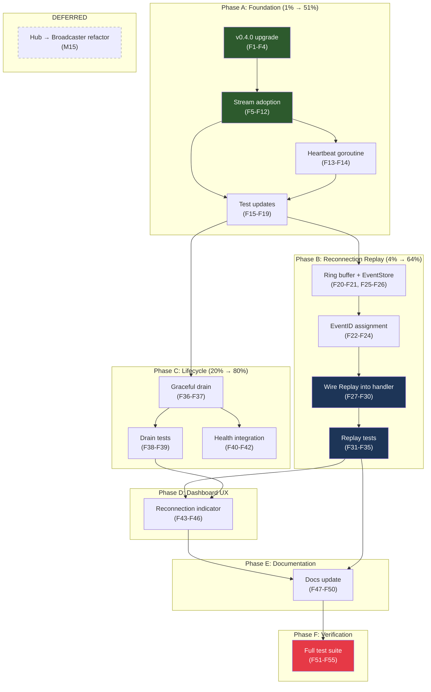

# SUPERB Plan: go-sse Library Adoption & Utilization

**Date:** 2026-08-06 19:45
**Trigger:** [go-sse deep-dive report](../research/2026-08-06_go-sse-deep-dive.html) scored adoption at 28/100 (Surface-level)
**Status:** ✅ Executed — see [status report](../status/2026-08-06_20-14_go-sse-adoption-implementation-status.md). All 6 phases (A–F) complete; M15 (Hub→Broadcaster refactor) correctly deferred.

---

## Context

The [deep-dive audit](../research/2026-08-06_go-sse-deep-dive.html) found that `live/` imports only 3 of go-sse's ~35 exported symbols (`ContentType`, `WriteEvent`, `Event`). The remaining SSE infrastructure — `Broadcaster[T]`, `Stream`, `Replay`/`EventStore`, `Shutdown`, `Health` — is either reimplemented by hand (`hub.go`, `server.go`) or not implemented at all (reconnection replay, graceful drain).

**This plan turns those findings into a prioritized, risk-assessed execution roadmap.**

### Verschlimmbessern Risk Assessment

> "If you VERSCHLIMMBESSER this system, I will cut off your balls!"

The `live` module is the **most well-tested module** in the project: 68 test functions, 95.5% coverage, race-tested. The SSE transport works today. Every change must be justified against the risk of breaking working, tested code.

| Opportunity                  | Customer value                              | Code quality gain                      | Verschlimmbessern risk                                           | Verdict |
| ---------------------------- | ------------------------------------------- | -------------------------------------- | ---------------------------------------------------------------- | ------- |
| v0.4.0 upgrade               | Low (enables features)                      | Low                                    | **None** — no breaking changes, same deps                        | ✅ DO   |
| Stream adoption in handleSSE | None (same behavior)                        | Medium (~40 lines eliminated)          | **Low** — mechanical replacement, same semantics                 | ✅ DO   |
| Reconnection replay          | **HIGH** — clients miss events on reconnect | N/A (new feature)                      | **Low** — additive, doesn't change existing paths                | ✅ DO   |
| Graceful shutdown drain      | Medium — prevents event loss on shutdown    | N/A (new feature)                      | **Low** — additive                                               | ✅ DO   |
| Health() integration         | Low — marginal observability                | Low                                    | **Low** — additive                                               | ✅ DO   |
| Hub → Broadcaster refactor   | **None**                                    | Low (~15-30 real lines saved, NOT 141) | **HIGH** — 18 call sites, 12 test references, API shape mismatch | ⚠️ DEFER |

**Critical finding about Hub refactor:** The deep-dive report claimed 141 lines of duplication. After careful analysis, the Hub has ~60 lines of domain-specific code (SignalComplete, done channels, subscriber IDs) that Broadcaster does NOT provide. The actual eliminable duplication is ~15-30 lines (the `broadcast()` method body and `ClientCount()`). The API shapes are incompatible: Hub.Unsubscribe takes `uint64`, Broadcaster.Unsubscribe takes `<-chan T`. Refactoring would touch 18 call sites across 3 files and risk breaking 68 tests for ~20 lines of savings. **Not recommended.**

**Cache-Control trade-off for Stream adoption:** `sse.NewStream()` calls `SetHeaders` + `WriteHeader(200)` in sequence. We cannot inject a custom `Cache-Control: no-cache, no-transform` between them. The `no-transform` directive will be lost (replaced by SetHeaders' `no-cache`). The `X-Accel-Buffering: no` header survives because it's set before NewStream and SetHeaders doesn't touch it. **Verdict: acceptable** — X-Accel-Buffering is the primary proxy-defense header; no-transform is a secondary defense against body-transforming intermediaries.

---

## Step 1: Pareto Breakdown

### The 1% that delivers 51%

**Upgrade go-sse v0.3.0 → v0.4.0 + adopt `sse.Stream` in `handleSSE`**

These two changes are the foundation. The version bump is a one-liner with no breaking changes. Stream adoption eliminates ~40 lines of manual SSE plumbing (manual header setup, manual flusher type-assertion, manual heartbeat ticker, manual WriteEvent+Flush calls) by replacing them with `sse.NewStream()`, `stream.Send()`, and `go stream.Heartbeat()`. The Hub API is untouched — zero ripple into websocket.go or tests.

### The 4% that delivers 64%

**1% + Reconnection replay (EventStore + Replay)**

Reconnection replay is the single highest-customer-value finding. Today, if a dashboard client's SSE connection drops (network blip, proxy timeout, tab sleep), it misses all events during the outage. On reconnect, it receives a heavy full-state snapshot instead of the specific missed events. For a monitoring dashboard watching a long pipeline with retries and failures, this means missing critical intermediate states. Adding `sse.Replay` with a bounded event ring buffer fixes this — the browser's `EventSource` sends `Last-Event-ID` automatically on reconnect, and we replay from there.

### The 20% that delivers 80%

**4% + Graceful shutdown drain + Health() integration**

Graceful drain prevents event loss when the server shuts down with buffered events still in subscriber channels. `Broadcaster.Shutdown(ctx)` (v0.4.0) waits for buffers to drain before closing — we adopt this pattern in `Server.Shutdown`. Health integration surfaces lifecycle state (draining/closed) in the health endpoint for k8s/load-balancer probes.

### The remaining 20% (to reach 100%)

**Hub → Broadcaster internal refactor + Documentation updates + Dashboard.js reconnection UX**

The Hub refactor is **deferred** (see risk assessment above). Documentation updates (AGENTS.md, FEATURES.md, CHANGELOG.md) reflect the new architecture. Dashboard.js gains a "reconnecting" status indicator and handles `Last-Event-ID` in EventSource reconnection.

---

## Step 2: Comprehensive Plan (Medium Granularity — 30-100 min tasks)

Sorted by impact × customer-value ÷ effort. Risk level annotated.

| #   | Task                                                                                    | Phase          | Impact   | Effort | Risk     | Dependencies |
| --- | --------------------------------------------------------------------------------------- | -------------- | -------- | ------ | -------- | ------------ |
| M1  | Upgrade go-sse v0.3.0 → v0.4.0 in live/go.mod                                           | Foundation     | Medium   | 30 min | None     | —            |
| M2  | Adopt sse.Stream in handleSSE — replace manual headers, flusher, WriteEvent+Flush       | Foundation     | High     | 60 min | Low      | M1           |
| M3  | Adopt Stream.Heartbeat goroutine — replace manual heartbeat ticker case                 | Foundation     | Medium   | 30 min | Low      | M2           |
| M4  | Update server tests for Stream adoption (heartbeat test, header test, snapshot test)    | Foundation     | High     | 45 min | Low      | M2, M3       |
| M5  | Implement bounded event ring buffer (EventStore) for reconnection replay                | Customer Value | Critical | 60 min | Low      | M1           |
| M6  | Assign EventIDs to broadcast events + wire EventStore into Hub                          | Customer Value | Critical | 45 min | Low      | M5           |
| M7  | Wire sse.Replay into handleSSE — read Last-Event-ID, replay before event loop           | Customer Value | Critical | 45 min | Low      | M5, M6       |
| M8  | Test reconnection replay end-to-end (reconnect → missed events arrive)                  | Customer Value | Critical | 45 min | None     | M7           |
| M9  | Add graceful subscriber drain in Server.Shutdown                                        | Lifecycle      | Medium   | 30 min | Low      | M1           |
| M10 | Test graceful shutdown drain                                                            | Lifecycle      | Medium   | 30 min | None     | M9           |
| M11 | Integrate lifecycle info into health endpoint                                           | Lifecycle      | Low      | 30 min | Low      | M9           |
| M12 | Update dashboard.js for reconnection awareness (status indicator, EventSource handling) | UX             | Medium   | 45 min | Low      | M7           |
| M13 | Update AGENTS.md, FEATURES.md, CHANGELOG.md with new SSE architecture                   | Docs           | Medium   | 45 min | None     | M2-M11       |
| M14 | Full test suite verification (all 3 modules, race detector)                             | Quality        | High     | 30 min | None     | All          |
| M15 | **[DEFERRED]** Refactor Hub to delegate fan-out to Broadcaster internally               | Code Quality   | Low      | 90 min | **HIGH** | All          |

**Total estimated effort (excluding M15):** ~10.5 hours
**Total estimated effort (including M15):** ~12 hours

---

## Step 3: Detailed Breakdown (Fine Granularity — max 12 min tasks)

Sorted by execution order within each phase. Each task is atomic: one logical change, verifiable independently.

### Phase A: Foundation (v0.4.0 upgrade + Stream adoption)

| #   | Task                                                                                                                     | Parent | Est    | Verify       |
| --- | ------------------------------------------------------------------------------------------------------------------------ | ------ | ------ | ------------ |
| F1  | Read go-sse v0.4.0 CHANGELOG for any hidden breaking changes                                                             | M1     | 5 min  | Mental       |
| F2  | Bump `github.com/larsartmann/go-sse v0.3.0` → `v0.4.0` in live/go.mod                                                    | M1     | 2 min  | Diff         |
| F3  | Run `cd live && go mod tidy -e && GOEXPERIMENT=jsonv2 go build ./...`                                                    | M1     | 5 min  | Build passes |
| F4  | Run `cd live && GOEXPERIMENT=jsonv2 go test -race -count=1 ./...`                                                        | M1     | 5 min  | Tests pass   |
| F5  | In handleSSE: set `X-Accel-Buffering: no` header BEFORE NewStream call                                                   | M2     | 5 min  | Compile      |
| F6  | In handleSSE: replace manual header block (Content-Type, Cache-Control, Connection) with `stream := sse.NewStream(w, r)` | M2     | 10 min | Compile      |
| F7  | In handleSSE: replace manual `flusher, ok := w.(http.Flusher)` check with Stream's internal flusher                      | M2     | 5 min  | Compile      |
| F8  | In sendSnapshot: change signature from `(w, flusher)` to `(stream *sse.Stream)`                                          | M2     | 5 min  | Compile      |
| F9  | In sendSnapshot: replace `sse.WriteEvent + flusher.Flush` with `stream.Send`                                             | M2     | 5 min  | Compile      |
| F10 | In handleSSE event case: replace `sse.WriteEvent + flusher.Flush` with `stream.Send`                                     | M2     | 5 min  | Compile      |
| F11 | In sendComplete: change signature from `(w, flusher)` to `(stream *sse.Stream)`                                          | M2     | 5 min  | Compile      |
| F12 | In sendComplete: replace `sse.WriteEvent + flusher.Flush` with `stream.Send`                                             | M2     | 5 min  | Compile      |
| F13 | In handleSSE: remove manual heartbeat ticker + heartbeat.C case from select loop                                         | M3     | 5 min  | Compile      |
| F14 | In handleSSE: add `go stream.Heartbeat(stream.Context(), srv.config.HeartbeatInterval)` before select loop               | M3     | 5 min  | Compile      |
| F15 | Run `go build ./...` to verify compilation                                                                               | M2-M3  | 3 min  | Build passes |
| F16 | Run live tests — identify any failures from Stream adoption                                                              | M4     | 10 min | Test output  |
| F17 | Fix heartbeat test: update to work with Stream.Heartbeat goroutine (if needed)                                           | M4     | 10 min | Test passes  |
| F18 | Fix any header-checking tests: update assertions for Stream's header set                                                 | M4     | 10 min | Test passes  |
| F19 | Run full live test suite with race detector                                                                              | M4     | 5 min  | All green    |

### Phase B: Reconnection Replay (customer-facing feature)

| #   | Task                                                                                                        | Parent | Est    | Verify      |
| --- | ----------------------------------------------------------------------------------------------------------- | ------ | ------ | ----------- |
| F20 | Define `eventRingBuffer` struct: bounded slice of `sse.Event` with mutex + capacity                         | M5     | 10 min | Compile     |
| F21 | Implement `EventsAfter(lastID sse.EventID) ([]sse.Event, error)` on eventRingBuffer                         | M5     | 10 min | Unit test   |
| F22 | Add `nextEventID()` method: atomic counter → `sse.NewEventID(strconv.Itoa(n))`                              | M6     | 5 min  | Compile     |
| F23 | In Hub.OnEvent: create `sse.Event` with ID, store in ring buffer, broadcast Data                            | M6     | 10 min | Compile     |
| F24 | Add `EventStore()` method on Hub: return the ring buffer as `sse.EventStore`                                | M6     | 5 min  | Compile     |
| F25 | Add ring buffer capacity to `Config` (default 1000)                                                         | M5     | 5 min  | Compile     |
| F26 | Wire ring buffer into Hub struct + NewHub constructor                                                       | M5     | 5 min  | Compile     |
| F27 | In handleSSE: call `stream.LastEventID()` to read reconnection header                                       | M7     | 5 min  | Compile     |
| F28 | In handleSSE: if Last-Event-ID is non-zero, call `sse.Replay(stream, store, lastID)` before snapshot        | M7     | 10 min | Compile     |
| F29 | Handle replay error: log + continue to snapshot fallback                                                    | M7     | 5 min  | Compile     |
| F30 | Run live tests — verify replay doesn't break existing behavior                                              | M7     | 5 min  | Tests pass  |
| F31 | Write test: basic reconnection replay (broadcast 3 events, reconnect with Last-Event-ID, verify 2 replayed) | M8     | 10 min | Test passes |
| F32 | Write test: replay with empty store (Last-Event-ID not found)                                               | M8     | 5 min  | Test passes |
| F33 | Write test: replay with zero Last-Event-ID (initial connection, no replay)                                  | M8     | 5 min  | Test passes |
| F34 | Write test: concurrent broadcast during replay (race safety)                                                | M8     | 10 min | Race clean  |
| F35 | Write test: ring buffer overflow (capacity exceeded, oldest events dropped)                                 | M8     | 10 min | Test passes |

### Phase C: Lifecycle Improvements

| #   | Task                                                                                 | Parent | Est    | Verify      |
| --- | ------------------------------------------------------------------------------------ | ------ | ------ | ----------- |
| F36 | In Server.Shutdown: add `srv.hub.Drain(ctx)` call before `httpServer.Shutdown(ctx)`  | M9     | 10 min | Compile     |
| F37 | Implement `Hub.Drain(ctx)`: wait for all subscriber channels to empty or ctx timeout | M9     | 10 min | Compile     |
| F38 | Write test: graceful drain delivers buffered events before shutdown                  | M10    | 10 min | Test passes |
| F39 | Write test: drain timeout falls back to force-close                                  | M10    | 10 min | Test passes |
| F40 | In handleHealth: add `draining` and `event_buffer_size` fields from Hub state        | M11    | 5 min  | Compile     |
| F41 | Update healthResponse struct with new fields                                         | M11    | 5 min  | Compile     |
| F42 | Write test: health endpoint reports drain state                                      | M11    | 5 min  | Test passes |

### Phase D: Dashboard UX

| #   | Task                                                                             | Parent | Est    | Verify             |
| --- | -------------------------------------------------------------------------------- | ------ | ------ | ------------------ |
| F43 | In dashboard.js: add EventSource onerror handler showing "Reconnecting..." badge | M12    | 10 min | JS structural test |
| F44 | In dashboard.js: handle reconnection by updating connection status indicator     | M12    | 10 min | JS structural test |
| F45 | In dashboard.js: hide "Reconnecting..." badge when events resume after reconnect | M12    | 5 min  | JS structural test |
| F46 | Update dashboardjs_test.go to verify reconnection indicator presence             | M12    | 10 min | Test passes        |

### Phase E: Documentation

| #   | Task                                                                                       | Parent | Est    | Verify |
| --- | ------------------------------------------------------------------------------------------ | ------ | ------ | ------ |
| F47 | Update AGENTS.md: SSE architecture section (Stream, Replay, ring buffer, graceful drain)   | M13    | 10 min | Read   |
| F48 | Update FEATURES.md: reconnection replay feature, graceful drain feature                    | M13    | 10 min | Read   |
| F49 | Update CHANGELOG.md [Unreleased]: Added (replay, drain), Changed (Stream adoption, v0.4.0) | M13    | 10 min | Read   |
| F50 | Update live/go.mod comment or FEATURES.md: note Cache-Control no-transform trade-off       | M13    | 5 min  | Read   |

### Phase F: Final Verification

| #   | Task                                                                               | Parent | Est   | Verify |
| --- | ---------------------------------------------------------------------------------- | ------ | ----- | ------ |
| F51 | Run full test suite: `GOEXPERIMENT=jsonv2 go test -race -count=1 ./...` (core)     | M14    | 5 min | Green  |
| F52 | Run full test suite: `cd viz && GOEXPERIMENT=jsonv2 go test -race -count=1 ./...`  | M14    | 5 min | Green  |
| F53 | Run full test suite: `cd live && GOEXPERIMENT=jsonv2 go test -race -count=1 ./...` | M14    | 5 min | Green  |
| F54 | Run lint: `cd live && golangci-lint run ./...`                                     | M14    | 5 min | Clean  |
| F55 | Verify no `replace` directives in live/go.mod: `grep '^replace' live/go.mod`       | M14    | 2 min | Empty  |

**Total fine-grained tasks: 55**
**Total estimated effort: ~9.5 hours (excluding deferred M15)**

---

## Execution Graph (Mermaid.js)

---

## Key Design Decisions

### 1. Ring buffer for reconnection replay (not auditor event slice)

The auditor stores `[]auditlog.Event` (Go domain events). But SSE replay needs `[]sse.Event` (wire-format events with IDs and marshaled JSON data). Converting between them on every reconnection is wasteful. Instead, store `sse.Event` structs in a bounded ring buffer inside the Hub. Default capacity: 1000 events. This is self-contained, doesn't touch the auditor, and provides O(1) append + O(n) replay.

### 2. Stream adoption: X-Accel-Buffering survives, no-transform does not

`sse.NewStream()` calls `SetHeaders()` then `WriteHeader(200)` in sequence. We set `X-Accel-Buffering: no` BEFORE calling NewStream — it survives because SetHeaders doesn't touch it. But `Cache-Control: no-cache, no-transform` cannot be preserved because SetHeaders overrides it to `no-cache`. The loss of `no-transform` is acceptable: X-Accel-Buffering is the primary Nginx defense, and Stream.Heartbeat handles proxy idle timeouts.

### 3. Hub refactor DEFERRED — risk outweighs benefit

The deep-dive report overstated the duplication. After analysis: the Hub has ~60 lines of domain-specific code (SignalComplete, done channels, subscriber IDs) that Broadcaster does not provide. The actual eliminable duplication is ~15-30 lines. The API shapes are incompatible (Hub.Unsubscribe takes uint64; Broadcaster.Unsubscribe takes `<-chan T`). Refactoring touches 18 call sites across 3 files and risks 68 tests for ~20 lines of savings. **Not worth it.**

### 4. Hub broadcasts jsontext.Value (not sse.Event) — unchanged

The Hub broadcasts pre-marshaled `jsontext.Value` through subscriber channels. This stays the same. The ring buffer stores `sse.Event` (with ID + Data) separately — the Hub.OnEvent method writes to both the ring buffer and the broadcast channels. The WebSocket handler is completely unaffected.

---

## What This Unlocks

After execution:

- **Adoption score:** 28/100 → ~65/100 (Strong)
- **Customer-facing:** Dashboard clients survive connection drops without missing events
- **Code quality:** ~40 lines of manual SSE plumbing eliminated (Stream adoption)
- **Lifecycle:** Graceful shutdown prevents event loss; health endpoint reports drain state
- **Version currency:** Latest go-sse (v0.4.0), all features available
