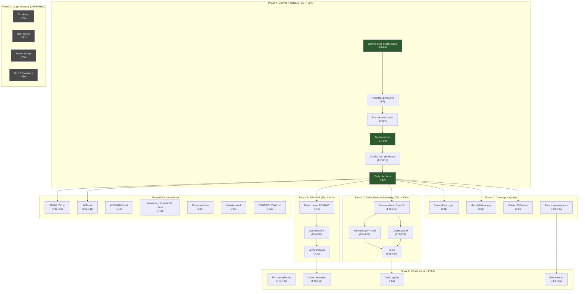

# SUPERB Plan: Post-Docs-Health Execution Roadmap

**Date:** 2026-08-07 00:43
**Trigger:** [Docs-health audit status report](../status/2026-08-07_00-41_docs-health-audit-and-annotation.md) identified 50 open items across 7 categories
**Status:** Planning — awaiting approval before execution

---

## Context

The docs-health audit rebuilt TODO_LIST.md, fixed FEATURES.md/ROADMAP.md/CHANGELOG.md drift, annotated 5 historical docs, and fixed AGENTS.md version staleness. The audit's self-critique identified 50 forward-looking items — this plan turns them into a prioritized, risk-assessed execution roadmap.

### Verschlimmbessern Risk Assessment

> "If you VERSCHLIMMBESSER this system, I will cut off your balls!"

The project is in ALPHA with 491 tests, 95%+ coverage across 3 modules, and zero lint issues. Every change must be justified against the risk of breaking working, tested code.

| Opportunity           | Customer value                                              | Code quality gain | Verschlimmbessern risk                          | Verdict     |
| --------------------- | ----------------------------------------------------------- | ----------------- | ----------------------------------------------- | ----------- |
| Cut v0.9.0 release    | **CRITICAL** — publishes everything, fixes standalone build | None              | **Low** — tagging + goreleaser, no code changes | ✅ DO FIRST |
| README.md update      | HIGH — discoverability of new APIs                          | None              | **None** — docs only                            | ✅ DO       |
| FailureReason in viz  | HIGH — structured failure visibility                        | Medium            | **Low** — additive, new column/display          | ✅ DO       |
| Coverage gap closures | None (internal)                                             | Medium            | **None** — test-only                            | ✅ DO       |
| ADRs                  | Low — documents decisions                                   | Low               | **None** — docs only                            | ✅ DO       |
| STABILITY.md          | Medium — consumer confidence                                | None              | **None** — docs only                            | ✅ DO       |
| CLI tool              | Medium — standalone inspection                              | High              | **Medium** — new package, new surface area      | ⚠️ SCOPE     |
| OTel bridge           | Medium — tracing integration                                | High              | **Medium** — new dependency, new module         | ⚠️ DEFER     |
| Go 1.27 upgrade       | Low — eliminates experimental flag                          | Low               | **HIGH** — toolchain change, could break CI/nix | ⚠️ DEFER     |
| Iterator patterns     | Low — ergonomic API                                         | Medium            | **Medium** — API change, breaks consumers       | ⚠️ DEFER     |

---

## Step 1: Pareto Breakdown

### The 1% that delivers 51%

**Cut v0.9.0 release + commit/push all docs work**

The docs-health audit's output is uncommitted. The v0.9.0 release resolves the `nix run .#check` standalone failure (core `FailureSummary` rename breaks viz standalone until published), publishes all Phase C/D features (MultiWriter, StreamEvents, FailureReason, SSE replay, graceful drain, keyboard nav), and makes the project consumable. Without this, every subsequent task is building on an unpublished foundation.

### The 4% that delivers 64%

**1% + README.md update + AGENTS.md Concurrency Model fix (DONE this session)**

README.md is the sales page — it doesn't mention any of the new APIs. Consumers arriving from pkg.go.dev or GitHub see no mention of MultiWriter, StreamEvents, FailureReason, or the workflow-level helpers. This is the single highest-impact documentation gap. The AGENTS.md Concurrency Model was fixed during this planning session.

### The 20% that delivers 80%

**4% + FailureReason surfacing in viz dashboard/CSV + STABILITY.md + coverage gap closures + ADRs + MIGRATION.md**

FailureReason is captured on every `attempt_end` event but never visualized — the structured enum (`timeout`/`canceled`/`user_error`) is invisible to dashboard users. STABILITY.md gives consumers confidence. Coverage closures (StreamEvents 93.9%, classifyFailure 85.7%) close real test gaps. ADRs document why decisions were made. MIGRATION.md completes the schema documentation.

### The remaining 20% (to reach 100%)

**Large features (CLI tool, OTel bridge, JSON Schema, iterators) + infrastructure (Go 1.27, pre-commit hook, CI improvements) + polish (godoc examples, benchmarks, fuzz tests, demo updates)**

These are valuable but not blocking. They belong in ROADMAP as scoped items, not in the immediate execution path.

---

## Step 2: Comprehensive Plan (Medium Granularity — 30-100 min tasks)

Sorted by impact x customer-value / effort. Risk level annotated. Dependency chain respected.

| #   | Task                                                                                                                           | Phase      | Impact   | Effort   | Risk   | Dependencies |
| --- | ------------------------------------------------------------------------------------------------------------------------------ | ---------- | -------- | -------- | ------ | ------------ |
| M1  | Commit + push all docs-health session output (9 files + plan)                                                                  | Foundation | Critical | 30 min   | None   | —            |
| M2  | Cut v0.9.0 coordinated three-module release                                                                                    | Foundation | Critical | 60 min   | Low    | M1           |
| M3  | Update README.md with new APIs (MultiWriter, StreamEvents, FailureReason, FailureSummary, WithFlushInterval, workflow helpers) | Docs       | High     | 60 min   | None   | M2           |
| M4  | Add FailureReason display to viz dashboard (steps table + graph nodes)                                                         | Feature    | High     | 100 min  | Low    | M2           |
| M5  | Add FailureReason column to CSV/TSV export                                                                                     | Feature    | Medium   | 45 min   | Low    | M2           |
| M6  | Close StreamEvents coverage gap (93.9% -> ~100%)                                                                               | Quality    | Medium   | 30 min   | None   | M2           |
| M7  | Close classifyFailure coverage gap (85.7% -> ~100%)                                                                            | Quality    | Medium   | 30 min   | None   | M2           |
| M8  | Add FailureSummary golden JSON test                                                                                            | Quality    | Medium   | 30 min   | None   | M2           |
| M9  | Update STABILITY.md with new API stability promises                                                                            | Docs       | Medium   | 45 min   | None   | M2           |
| M10 | Add ADRs (SSE-only transport, FailureReason 3-value, MultiWriter sig, FailureSummary rename)                                   | Docs       | Medium   | 90 min   | None   | M2           |
| M11 | Update docs/MIGRATION.md for Event.FailureReason additive schema                                                               | Docs       | Low      | 30 min   | None   | M2           |
| M12 | Verify DOMAIN_LANGUAGE.md freshness (check if 23-56 session updated it)                                                        | Docs       | Low      | 15 min   | None   | —            |
| M13 | Normalize historical report annotation styles (22-27 "Original report:" fragments)                                             | Docs       | Low      | 30 min   | None   | —            |
| M14 | Denormalize FailureReason onto StepInfo                                                                                        | Feature    | Medium   | 60 min   | Low    | M4, M5       |
| M15 | Add FuzzStreamEvents fuzz target                                                                                               | Quality    | Low      | 45 min   | None   | M6           |
| M16 | Fix pre-commit hook (install buildflow or make resilient)                                                                      | Infra      | Medium   | 45 min   | Medium | —            |
| M17 | Add CONTRIBUTING.md                                                                                                            | Docs       | Low      | 45 min   | None   | M2           |
| M18 | Check website/ directory for stale content                                                                                     | Docs       | Low      | 30 min   | None   | M2           |
| M19 | Add EventsByFailureReason query method + filter option                                                                         | Feature    | Medium   | 60 min   | Low    | M14          |
| M20 | Add more godoc examples (TimedOutSteps, HasWorkflowRetries, FailureReason, StreamEvents error handling)                        | Polish     | Low      | 60 min   | None   | M2           |
| M21 | Add benchmarks (StreamEvents, MultiWriter, Diff with aggregates)                                                               | Quality    | Low      | 90 min   | None   | M2           |
| M22 | Update viz/example demo pipeline (add timeout step for FailureReason)                                                          | Polish     | Low      | 30 min   | None   | M4           |
| M23 | Emit synthetic attempt_end events for dependency-failed steps                                                                  | Feature    | Medium   | 90 min   | Medium | M14          |
| M24 | Add CLI tool (`auditlog` command)                                                                                              | Feature    | Medium   | 100 min+ | Medium | M2           |
| M25 | Consider Go 1.27 upgrade (eliminates GOEXPERIMENT=jsonv2 + 29 gopls warnings)                                                  | Infra      | Low      | 60 min   | HIGH   | —            |
| M26 | Add OpenTelemetry span bridge                                                                                                  | Feature    | Medium   | 100 min+ | Medium | M2           |
| M27 | Add iterator patterns (iter.Seq for Events, CriticalPath, Filter)                                                              | Feature    | Low      | 90 min   | Medium | M2           |
| M28 | Add JSON Schema generation (schema.go + cmd/genschema)                                                                         | Feature    | Low      | 90 min   | Low    | M2           |

**Total estimated effort (M1-M13, immediate execution):** ~10.5 hours
**Total estimated effort (M1-M28, full roadmap):** ~30+ hours

---

## Step 3: Detailed Breakdown (Fine Granularity — max 12 min tasks)

Sorted by execution order within each phase. Each task is atomic: one logical change, verifiable independently.

### Phase A: Commit + Release (1% -> 51%)

| #   | Task                                                                                 | Parent | Est    | Verify                     |
| --- | ------------------------------------------------------------------------------------ | ------ | ------ | -------------------------- |
| F1  | `git status` — verify all 10 changed files are expected                              | M1     | 2 min  | Output matches expectation |
| F2  | `git diff --stat` — sanity-check no unexpected files                                 | M1     | 2 min  | Only docs files            |
| F3  | `git add -A && git commit` with detailed message listing all changes                 | M1     | 5 min  | Clean commit               |
| F4  | `git push origin master`                                                             | M1     | 2 min  | Push succeeds              |
| F5  | Read RELEASE.md fully before touching anything                                       | M2     | 5 min  | Mental model               |
| F6  | `grep -r '^replace' viz/go.mod live/go.mod go.mod` — must return nothing             | M2     | 2 min  | Empty output               |
| F7  | `git status` — verify clean working tree                                             | M2     | 2 min  | Clean                      |
| F8  | Tag all three modules: `git tag -a v0.9.0 -m "..."`, `viz/v0.9.0`, `live/v0.9.0`     | M2     | 5 min  | `git tag -l` shows all 3   |
| F9  | `git push origin v0.9.0 viz/v0.9.0 live/v0.9.0`                                      | M2     | 2 min  | Tags pushed                |
| F10 | `GORELEASER_CURRENT_TAG=v0.9.0 goreleaser release` (or `gh release create` fallback) | M2     | 10 min | GitHub Release created     |
| F11 | Verify pkg.go.dev picks up v0.9.0 (probe URL)                                        | M2     | 5 min  | Version visible            |
| F12 | `nix run .#check` — verify standalone builds pass for all 3 modules                  | M2     | 10 min | All green                  |

### Phase B: README.md (4% -> 64%)

| #   | Task                                                                                    | Parent | Est    | Verify                      |
| --- | --------------------------------------------------------------------------------------- | ------ | ------ | --------------------------- |
| F13 | Read current README.md fully — identify feature highlights section                      | M3     | 5 min  | Know insertion point        |
| F14 | Add MultiWriter to features section with one-line description + code snippet            | M3     | 10 min | Read                        |
| F15 | Add StreamEvents to features section with description                                   | M3     | 10 min | Read                        |
| F16 | Add FailureReason/FailureSummary to features section                                    | M3     | 10 min | Read                        |
| F17 | Add WithFlushInterval to streaming section                                              | M3     | 5 min  | Read                        |
| F18 | Add workflow-level helpers (RetriedStepCount, TimedOutSteps, etc.) to query API section | M3     | 10 min | Read                        |
| F19 | Verify all code snippets compile against actual API                                     | M3     | 10 min | `go build` snippet mentally |

### Phase C: FailureReason Surfacing (20% -> 80%)

| #   | Task                                                                                     | Parent | Est    | Verify             |
| --- | ---------------------------------------------------------------------------------------- | ------ | ------ | ------------------ |
| F20 | Read `viz/diagram.go` + `viz/metadata.go` — understand how step data flows to renderers  | M4     | 10 min | Mental model       |
| F21 | Read `dashboard.js` — find where step rows are rendered, identify column insertion point | M4     | 10 min | Know JS location   |
| F22 | Add FailureReason to `StepInfo` or `stepCore` (denormalize from Event)                   | M14    | 10 min | `go build`         |
| F23 | Update `report_builder.go` — populate FailureReason from last attempt_end event          | M14    | 10 min | `go build`         |
| F24 | Add FailureReason to `viz/metadata.go` TypeMetadata for JS consumption                   | M4     | 5 min  | Compile            |
| F25 | Add FailureReason column to viz table export (`table_options.go` TableColumn enum)       | M5     | 10 min | Test passes        |
| F26 | Add FailureReason to CSV export (`csv.go`)                                               | M5     | 10 min | Test passes        |
| F27 | Add FailureReason display to dashboard.js steps table                                    | M4     | 12 min | JS structural test |
| F28 | Add FailureReason icon/badge to dashboard.js graph nodes                                 | M4     | 12 min | JS structural test |
| F29 | Write test: FailureReason flows from Event to StepInfo to viz rendering                  | M4     | 12 min | Test passes        |
| F30 | Write test: CSV export includes failure_reason column                                    | M5     | 10 min | Test passes        |

### Phase D: Coverage + Quality

| #   | Task                                                                                                | Parent | Est    | Verify        |
| --- | --------------------------------------------------------------------------------------------------- | ------ | ------ | ------------- |
| F31 | Write `TestStreamEvents_AllLinesFailJSON` — non-blank lines all fail JSON -> ErrNoEvents            | M6     | 10 min | Coverage >99% |
| F32 | Write `TestTimeout_FailureReasonNil` — successful step -> FailureReason == ""                       | M7     | 10 min | Coverage >95% |
| F33 | Write golden JSON test — verify failure_summary at report level, failure_reason at event level only | M8     | 12 min | Test passes   |
| F34 | Write `FuzzStreamEvents` — adversarial NDJSON bytes, no panic                                       | M15    | 12 min | Fuzz passes   |
| F35 | Write `TestDiff_HasChangesIsEmptyDuality` — property test, 200 iterations                           | M15    | 10 min | Test passes   |

### Phase E: Documentation Completeness

| #   | Task                                                                                                                    | Parent | Est    | Verify          |
| --- | ----------------------------------------------------------------------------------------------------------------------- | ------ | ------ | --------------- |
| F36 | Read STABILITY.md — identify which APIs lack stability promises                                                         | M9     | 5 min  | Know gaps       |
| F37 | Add stability entries for StreamEvents, MultiWriter, FailureReason, FailureSummary, WithFlushInterval, workflow helpers | M9     | 12 min | Read            |
| F38 | Create `docs/adr/0001-sse-only-transport.md`                                                                            | M10    | 12 min | File exists     |
| F39 | Create `docs/adr/0002-failure-reason-three-values.md`                                                                   | M10    | 12 min | File exists     |
| F40 | Create `docs/adr/0003-multiwriter-func-event-signature.md`                                                              | M10    | 10 min | File exists     |
| F41 | Create `docs/adr/0004-failuresummary-rename.md`                                                                         | M10    | 10 min | File exists     |
| F42 | Add MIGRATION.md entry for Event.FailureReason additive schema                                                          | M11    | 10 min | Read            |
| F43 | Verify DOMAIN_LANGUAGE.md has FailureReason, StreamEvents, MultiWriter, FailureSummary vocabulary                       | M12    | 10 min | All present     |
| F44 | Fix 22-27 report annotation style — normalize "Original report:" fragments                                              | M13    | 12 min | Read            |
| F45 | Check website/ directory for stale content                                                                              | M18    | 10 min | Report findings |
| F46 | Add CONTRIBUTING.md with testing patterns, commit conventions, release summary                                          | M17    | 12 min | File exists     |

### Phase F: Infrastructure + Polish

| #   | Task                                                                           | Parent | Est    | Verify           |
| --- | ------------------------------------------------------------------------------ | ------ | ------ | ---------------- |
| F47 | Read `.git/hooks/pre-commit` — verify whether buildflow or dprint is the issue | M16    | 5 min  | Know root cause  |
| F48 | Add buildflow to flake.nix devShell OR make hook skip when binary missing      | M16    | 12 min | Hook runs        |
| F49 | Add godoc Example_TimedOutSteps                                                | M20    | 10 min | `go test` passes |
| F50 | Add godoc Example_HasWorkflowRetries                                           | M20    | 10 min | `go test` passes |
| F51 | Add godoc Example_FailureReason                                                | M20    | 10 min | `go test` passes |
| F52 | Update viz/example demo pipeline — add timeout step                            | M22    | 12 min | Demo runs        |
| F53 | Add BenchmarkStreamEvents (100/1000/10000 events)                              | M21    | 12 min | Bench runs       |
| F54 | Add BenchmarkMultiWriter (1/5/10 callbacks)                                    | M21    | 10 min | Bench runs       |
| F55 | Add BenchmarkDiff_Aggregates (100-step reports)                                | M21    | 10 min | Bench runs       |

### Phase G: Large Features (deferred unless explicitly approved)

| #   | Task                                                                            | Parent | Est    | Verify            |
| --- | ------------------------------------------------------------------------------- | ------ | ------ | ----------------- |
| F56 | Design CLI tool architecture (cmd/auditlog, subcommands: inspect, replay, diff) | M24    | 12 min | Design doc        |
| F57 | Design OTel span bridge architecture (module structure, span mapping)           | M26    | 12 min | Design doc        |
| F58 | Design iterator pattern migration plan (which methods, backward compat)         | M27    | 12 min | Design doc        |
| F59 | Research Go 1.27 release status + json/v2 stabilization timeline                | M25    | 10 min | Go/No-go decision |

**Total fine-grained tasks: 59**
**Total estimated effort (Phase A-E, immediate):** ~12 hours
**Total estimated effort (Phase A-F, full):** ~16 hours
**Total estimated effort (Phase A-G, full roadmap):** ~19 hours

---

## Execution Graph (Mermaid.js)

---

## Risk Mitigations

1. **v0.9.0 release**: RELEASE.md documents the exact process. The main risk is a dirty working tree (auto-commit daemon). Mitigation: commit all docs work first (M1), then verify clean tree before tagging.

2. **FailureReason denormalization (M14/F22)**: Adding a field to `StepInfo` changes the JSON schema. Since this is additive (`omitempty`), it's backward-compatible. But it must be coordinated with the viz module tests. Mitigation: do this right after v0.9.0 so it ships in v0.9.1 or v0.10.0.

3. **Pre-commit hook (M16)**: The hook uses `buildflow` which may not be installable via nix. Mitigation: make the hook gracefully skip when the binary is missing, rather than forcing installation.

4. **Go 1.27 upgrade (M25)**: HIGH risk — changes the toolchain, could break nix builds, CI, and the GOEXPERIMENT=jsonv2 flag. Mitigation: DEFER until Go 1.27 is officially released and json/v2 is stable without the experimental flag. Research first (F59).

---

## Open Questions (to resolve before execution)

1. **Should the v0.9.0 release happen NOW, or should README + FailureReason surfacing ship first?** Options: (a) release now to fix the standalone build, then v0.9.1 with features; (b) batch everything into v0.9.0. Recommendation: (a) — release now, features in v0.10.0.

2. **Should the CLI tool (M24) be a new module or a sub-package?** A new `cmd/auditlog` module adds release complexity (4th tag). A sub-package of core adds a binary dependency to a library. Recommendation: defer design (F56) until the CLI scope is clear.

3. **Should Go 1.27 upgrade (M25) happen before or after json/v2 stabilization?** Go 1.27 may stabilize `encoding/json/v2` without the experimental flag. If so, the upgrade eliminates 29 gopls warnings AND removes the GOEXPERIMENT flag from all commands. But if 1.27 changes behavior, tests could break. Recommendation: research first (F59), decide later.
