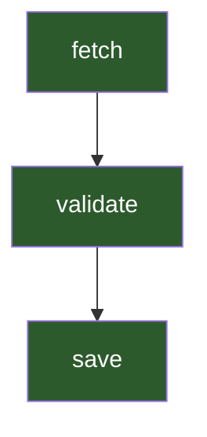

## Structured Data

### JSON Report

The full report as a single JSON object — steps, events, and aggregate metrics:

```go
_ = audit.ExportJSON("report.json")
// or:
_ = report.WriteJSON(os.Stdout)
```

### NDJSON Event Stream

Each event as a separate JSON line — ideal for streaming pipelines and log shippers:

```go
_ = audit.ExportNDJSON("events.ndjson")
// or:
_ = report.WriteNDJSON(os.Stdout)
```

## Diagrams

Export the step DAG with status-based coloring (succeeded = green, failed = red, skipped = gray, canceled = orange). Edges point dependency to step, following execution flow.

### Mermaid (renders natively in GitHub)

```go
_ = audit.ExportMermaid("dag.mmd")
```



### Graphviz DOT

```go
_ = audit.ExportGraphviz("dag.dot")
```

### D2

```go
_ = audit.ExportD2("dag.d2")
```

### PlantUML

```go
_ = audit.ExportPlantUML("dag.puml")
```

All four diagram methods are also available as `Write*` (to `io.Writer`) and `Write*String` (returns string):

```go
mmd, _ := report.WriteMermaidString()
dot, _ := report.WriteGraphvizString()
```

## Tables

Step summary table with columns: Step, Status, Duration, Attempts, Error. Supports 16 formats via [go-output](https://github.com/larsartmann/go-output):

```go
import "github.com/larsartmann/go-output"

_ = audit.ExportTable("summary.csv", output.FormatCSV, output.RenderOptions{})
_ = audit.ExportTable("summary.md", output.FormatMarkdown, output.RenderOptions{})
_ = audit.ExportTable("summary.html", output.FormatHTML, output.RenderOptions{})
```

Available formats: `table`, `json`, `csv`, `tsv`, `markdown`, `xml`, `yaml`, `html`, `jsonl`, `asciidoc`, `toml`, `plantuml`.

## Trees

### ASCII Tree

```go
_ = audit.ExportTree("tree.txt")
```

```
fetch
└── validate
    └── transform
        └── save
```

### HTML Tree

```go
_ = audit.ExportHTMLTree("tree.html")
```

Nested `<ul>` list of the step DAG, suitable for embedding in web pages.

## Three Duration Metrics

The report carries three duration fields. **Always use `wall_clock_duration_ms`** for user-facing summaries.

| Field                       | What it measures                                 | When it differs                                                                   |
| --------------------------- | ------------------------------------------------ | --------------------------------------------------------------------------------- |
| `total_duration_ms`         | Sum of every step's individual duration          | Inflated for parallel workflows — counts overlapping time multiple times.         |
| `wall_clock_duration_ms`    | Actual elapsed time (earliest to latest event)   | The "how long did I wait?" number. **Use this for summaries and `Diff()`.**       |
| `critical_path_duration_ms` | Longest dependency-chain duration (memoized DFS) | The bottleneck path. If you can only parallelize one thing, this tells you which. |

```go
report := audit.Report()
fmt.Printf("Wall clock: %.0fms\n", report.WallClockDurationMs)
fmt.Printf("Critical path: %.0fms\n", report.CriticalPathDurationMs)
fmt.Println(report.Duration()) // delegates to wall-clock
```
